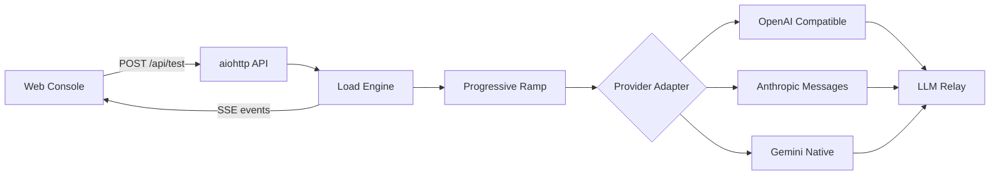

<div align="center">


# ⚡ LLMStorm

**A local-first, self-hostable concurrency benchmark for LLM relay services**

[](https://github.com/lien0219/LLMStorm/actions/workflows/ci.yml)
[](https://www.python.org/)
[](DEPLOYMENT.md)
[](https://github.com/lien0219/LLMStorm/pkgs/container/llmstorm)
[](LICENSE)

[简体中文](README.md) · [English](README.en.md)

[Quick start](#quick-start) · [Highlights](#highlights) · [Protocol matrix](#protocols) · [How it works](#how-it-works) · [Support](#support) · [Deployment](DEPLOYMENT.md) · [Contributing](CONTRIBUTING.md)

</div>

---

LLMStorm progressively increases pressure from a single request and turns **success rate, throughput, TTFT, P95 latency, HTTP status distribution, and failure details** into a clear capacity recommendation. No external database, no key persistence, and no guesswork.

<a id="highlights"></a>

## ✨ Highlights

<table>
  <tr>
    <td width="33%" valign="top"><strong>🌩️ Progressive load</strong><br><sub>Automatically probes 1 → 25% → 50% → 75% → maximum instead of hitting the upstream at full load immediately.</sub></td>
    <td width="33%" valign="top"><strong>📡 Live observability</strong><br><sub>SSE streams progress, successful requests, status codes, throughput, and P95 latency.</sub></td>
    <td width="33%" valign="top"><strong>🎯 Capacity result</strong><br><sub>Uses the configured success threshold to recommend the highest stable tested concurrency.</sub></td>
  </tr>
  <tr>
    <td valign="top"><strong>🔌 Multi-protocol</strong><br><sub>Native OpenAI Chat Completions, Anthropic Messages, and Gemini streaming support.</sub></td>
    <td valign="top"><strong>💰 Price comparison</strong><br><sub>Refresh model prices online, compare relay input/output/cache rates, and estimate cost from actual token usage.</sub></td>
    <td valign="top"><strong>🛡️ Local first</strong><br><sub>Keys stay in request memory and are never written to logs, files, or browser storage.</sub></td>
  </tr>
</table>

<a id="protocols"></a>

## 🧠 Protocol matrix

| Protocol | Providers and model families | Support |
| --- | --- | --- |
| OpenAI Chat Completions | GPT, DeepSeek, Qwen, GLM, Kimi, MiniMax, Grok, Mistral, and compatible relays | Streaming, reasoning content, exact/custom model IDs |
| Anthropic Messages | Claude and Claude Code aliases | Native headers and Messages stream parsing |
| Gemini Native | Gemini text models | Native `streamGenerateContent` parsing |

Every provider supports a **custom model ID**. Presets live in [`static/model_catalog.json`](static/model_catalog.json), so catalog updates do not touch the main UI logic.

<a id="quick-start"></a>

## 🚀 Quick start

### Run locally

Python 3.11 or newer is required:

```bash
git clone https://github.com/lien0219/LLMStorm.git
cd LLMStorm
python -m pip install -r requirements.txt
python web_app.py
```

Open **<http://127.0.0.1:8765>**.

### Docker Compose

```bash
git clone https://github.com/lien0219/LLMStorm.git
cd LLMStorm
docker compose up -d --build
```

Compose enables public safety mode and caps each test at 500 concurrent requests by default. Servers can pull versioned GHCR images directly; see [DEPLOYMENT.md](DEPLOYMENT.md) for publishing, upgrades, rollbacks, and proxy requirements.

<a id="how-it-works"></a>

## ⚙️ How it works



For a configured maximum `N`, LLMStorm tests the unique stages `1, 25% N, 50% N, 75% N, N`. Each stage sends one simultaneous wave containing as many requests as its concurrency. The recommendation is the highest tested stage meeting the configured success threshold.

> [!NOTE]
> This is a fast capacity probe, not a soak test. Real model calls may incur charges; start small.

## 🏗️ Extensible architecture

```text
llmstorm/providers/        Provider protocol adapters
llmstorm/policy.py         Benchmark thresholds and limits
static/model_catalog.json  Shared provider and model catalog
static/api.js              API and SSE transport
static/monitor.js          Result and log rendering
load_test_engine.py        Concurrency orchestration and metrics
web_app.py                 Web API and production security boundary
```

See [ARCHITECTURE.md](ARCHITECTURE.md) for module ownership, compatibility contracts, and provider extension steps.

## 🔐 Security boundary

- API keys, prompts, and test results are not persisted.
- Only total views and likes are stored in local SQLite; live presence is memory-only.
- Public mode blocks private, loopback, link-local, and reserved targets and requires HTTPS upstreams.
- Server-side per-test concurrency and global job limits are enforced.
- A hosted operator can still observe traffic at the network boundary; self-host when credentials are sensitive.
- Test only services you own or are explicitly authorized to test.

Report vulnerabilities privately through GitHub Security Advisories. See [SECURITY.md](SECURITY.md).

## ✅ Engineering quality

Every change is checked by:

- Python 3.11 / 3.13 test matrix
- Ruff linting and Mypy type checking
- Branch coverage threshold
- Playwright desktop, mobile, and locale regression tests
- Docker image build
- Dependabot dependency updates

<details>
<summary><strong>Show local validation commands</strong></summary>

```bash
python -m pip install -r requirements-dev.txt
python -m ruff check .
python -m mypy
python -m coverage run -m unittest discover -s tests -v
python -m coverage report
npm install
npx playwright install chromium
npm run check
npm run test:e2e
```

</details>

<a id="support"></a>

## 💚 Support and contact

If LLMStorm helped you understand your service capacity faster, you can support its continued maintenance by starring, sharing, reporting issues, or sponsoring the project.

| Channel | Details | Best for |
| --- | --- | --- |
| QQ | `1824851183` | Quick questions and sponsorship inquiries |
| Email | [1824851183@qq.com](mailto:1824851183@qq.com) | Bug reports, feature ideas, and collaboration |
| GitHub | [lien0219/LLMStorm](https://github.com/lien0219/LLMStorm) | Stars, issues, and pull requests |

For one-time or ongoing sponsorship, contact the maintainer via QQ or email to confirm the currently available options. The project never collects payment details through its website; beware of impersonators. See [SUPPORT.md](SUPPORT.md) for the full policy, or visit `/support` in a running instance.

## 🤝 Contributing and license

Issues and pull requests are welcome. Read [CONTRIBUTING.md](CONTRIBUTING.md) and [ARCHITECTURE.md](ARCHITECTURE.md) before making substantial changes.

LLMStorm is released under the [MIT License](LICENSE). The original CLI remains available through `python gpt_concurrency_test.py --help`.

---

<div align="center">
  <sub>Built for developers who want evidence, not guesses.</sub>
</div>
