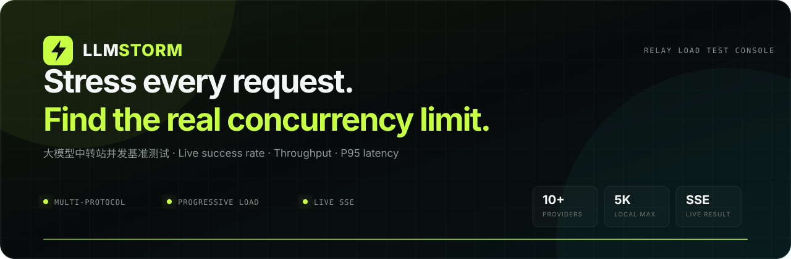
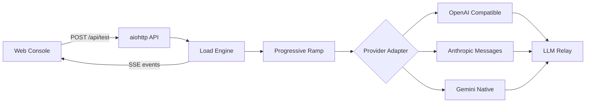

<div align="center">



# ⚡ LLMStorm

**本地优先、可自托管的大模型中转站并发基准测试平台**

[](https://github.com/lien0219/LLMStorm/actions/workflows/ci.yml)
[](https://www.python.org/)
[](DEPLOYMENT.md)
[](https://github.com/lien0219/LLMStorm/pkgs/container/llmstorm)
[](LICENSE)

[简体中文](README.md) · [English](README.en.md)

[快速开始](#quick-start) · [核心能力](#highlights) · [支持矩阵](#protocols) · [工作原理](#how-it-works) · [生产部署](DEPLOYMENT.zh-CN.md) · [参与贡献](CONTRIBUTING.md)

</div>

---

LLMStorm 从单请求开始逐档提升压力，把中转站的**成功率、吞吐量、TTFT、P95 延迟、HTTP 状态分布与失败详情**实时呈现出来，并给出经过实测的建议稳定并发。无需上传 Key，无需外部数据库，几分钟内即可看清真实容量边界。

<a id="highlights"></a>

## ✨ 核心能力

<table>
  <tr>
    <td width="33%" valign="top"><strong>🌩️ 逐档加压</strong><br><sub>按 1 → 25% → 50% → 75% → 最大值自动探测，避免一开始就冲击上游。</sub></td>
    <td width="33%" valign="top"><strong>📡 实时观测</strong><br><sub>通过 SSE 持续展示进度、成功请求、状态码、吞吐和 P95 延迟。</sub></td>
    <td width="33%" valign="top"><strong>🎯 容量结论</strong><br><sub>以成功率阈值为依据，输出建议稳定并发与完整分档结果。</sub></td>
  </tr>
  <tr>
    <td valign="top"><strong>🔌 多协议适配</strong><br><sub>原生支持 OpenAI Chat Completions、Anthropic Messages 与 Gemini 流式协议。</sub></td>
    <td valign="top"><strong>🧩 可持续扩展</strong><br><sub>厂商适配器、模型目录、压测策略和前端渲染相互解耦。</sub></td>
    <td valign="top"><strong>🛡️ 本地优先</strong><br><sub>Key 仅在单次请求内存中使用，不写入日志、文件或浏览器存储。</sub></td>
  </tr>
</table>

<a id="protocols"></a>

## 🧠 支持矩阵

| 协议 | 厂商与模型系列 | 能力 |
| --- | --- | --- |
| OpenAI Chat Completions | GPT、DeepSeek、Qwen、GLM、Kimi、MiniMax、Grok、Mistral 及兼容中转站 | 流式输出、推理内容、精确/自定义模型 ID |
| Anthropic Messages | Claude、Claude Code 别名 | 原生请求头、Messages 流式解析 |
| Gemini Native | Gemini 文本模型 | `streamGenerateContent` 原生流式解析 |

所有厂商都支持**手动输入自定义模型 ID**。模型预设统一维护在 [`static/model_catalog.json`](static/model_catalog.json)，新增模型无需修改主界面逻辑。

<a id="quick-start"></a>

## 🚀 快速开始

### 本地运行

需要 Python 3.11 或更高版本：

```bash
git clone https://github.com/lien0219/LLMStorm.git
cd LLMStorm
python -m pip install -r requirements.txt
python web_app.py
```

浏览器打开 **<http://127.0.0.1:8765>**。

### Docker Compose

```bash
git clone https://github.com/lien0219/LLMStorm.git
cd LLMStorm
docker compose up -d --build
```

Compose 默认启用公网安全模式，单次最大并发为 500。服务器可直接拉取带版本号的 GHCR 镜像；发布、升级与回滚流程见 [生产部署指南](DEPLOYMENT.zh-CN.md)。

<a id="how-it-works"></a>

## ⚙️ 工作原理



当最大并发为 `N` 时，系统测试去重后的 `1、25% N、50% N、75% N、N`。每档发送一轮与该档并发数相等的请求，建议值取成功率不低于配置阈值的最高已测档位。

> [!NOTE]
> 这是一轮快速容量探测，并非长时间稳定性压测。真实模型调用可能产生费用，请从小并发开始。

## 🏗️ 可扩展架构

```text
llmstorm/providers/      厂商协议适配器
llmstorm/policy.py       压测阈值与限制
static/model_catalog.json 共享厂商与模型目录
static/api.js            SSE 与 API 传输
static/monitor.js        结果和日志渲染
load_test_engine.py      并发调度与指标计算
web_app.py               Web API 与生产安全边界
```

模块职责、兼容契约和新增厂商步骤见 [ARCHITECTURE.md](ARCHITECTURE.md)。

## 🔐 安全边界

- 不持久化 API Key、提示词或测试结果。
- 公网模式阻止私有、回环、链路本地及保留地址，并强制使用 HTTPS 上游。
- 服务端提供单次并发上限和全局任务数限制。
- 托管实例运营者仍可能在服务器网络边界观察流量；敏感 Key 建议使用自托管实例。
- 仅可测试自己拥有或已获得明确授权的服务。

安全问题请通过 GitHub Security Advisory 私下报告，详见 [SECURITY.md](SECURITY.md)。

## ✅ 工程质量

项目通过以下门禁持续验证：

- Python 3.11 / 3.13 测试矩阵
- Ruff 静态检查与 Mypy 类型检查
- 分支覆盖率门槛
- Playwright 桌面端、移动端与国际化回归
- Docker 镜像构建检查
- Dependabot 依赖更新

<details>
<summary><strong>展开本地验证命令</strong></summary>

```bash
python -m pip install -r requirements-dev.txt
python -m ruff check .
python -m mypy
python -m coverage run -m unittest discover -s tests -v
python -m coverage report
npm install
npx playwright install chromium
npm run check
npm run test:e2e
```

</details>

## 🤝 贡献与许可

欢迎提交 Issue 和 Pull Request。开始贡献前请阅读 [CONTRIBUTING.md](CONTRIBUTING.md) 与 [ARCHITECTURE.md](ARCHITECTURE.md)。

LLMStorm 使用 [MIT License](LICENSE) 发布。原有命令行压测工具仍可通过 `python gpt_concurrency_test.py --help` 使用。

---

<div align="center">
  <sub>Built for developers who want evidence, not guesses.</sub>
</div>
